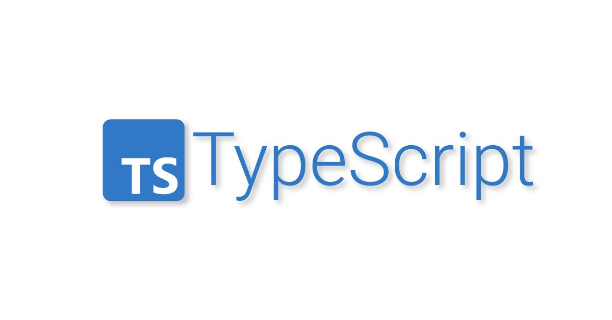

## Understanding TypeScript
In the beginning of this semester, I had no expectations of what TypeScript would change up in JavaScript. This is because in comparison, my knowledge of the JavaScript language was far less than my knowledge in Java, Python, etc. Although in hindsight, learning TypeScript was a lot easier just because a lot of skills are transferrable between languages, its just a matter of understanding the structure and syntax. After that uncomfortable/unfamiliarity, it becomes relatively smooth sailing. Of course, I honestly find the simplicity of TypeScript's ability to "assume" or inherently understand some types very handy (once you understand some shortcuts). From a software engineering perspective, I think TypeScript's flexibility, the fact that you're not required to declare types for everything, and strictness itself is optional, could be its weakness with high complexity operations or algorithms. But that's my personal opinion, I'm not exactly sure if that's true.

## WODs, WODs, and more WODs
My basic understanding of this language made me struggle a lot for the first week of WODs. I was still fresh off the coding assignment and didn't have a lot of time to digest the syntax of it all, so yes, it is absolutely stressful. Akin to math, I only ever find this activity enjoyable if I know what I'm doing, but since I'm still in the learning phase, its been like a 60% stress and 40% enjoyable. I'm a slow programmer and like to take time in deploying the best working code, so this structure of timed word problems always makes me anxious. Then again, OAs and technical interviews are prominent for anyone applying as a SWE in this century so, gotta get used to it. Overall, I hope that with time, these WODs become muscle memory and I can (hopefully) improve my time and have the ability to submit the quizzes early. 

## The Elephant in the Room
A side note here is that with the rapid growth of AI, it has become such a valuable resource when it is used as a personal tutor of sorts. For example, learning this new language has become a lot less problematic since any questions or misconceptions I had regarding some syntax (which I will always struggle with remembering in the first month) was quickly resolved by just asking the LLM. Of course, I'm still worried about this development because the volatility of AI is a real concern that does not just apply to cheating in school, there are a ton of implications with unrestricted AI that is a whole other topic to discuss.
