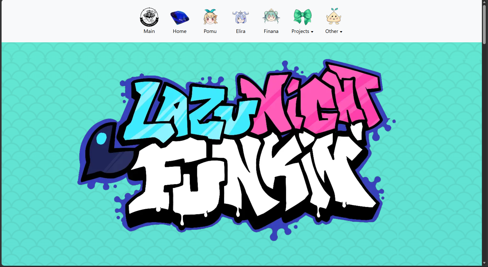

This image is a webpage I made using Bootstrap 5.

## Initial thoughts on Bootstrap 5

My first impression of Bootstrap 5 was honestly confusion. Back in my middle school webdev club, everything I made was raw HTML and CSS, so seeing a single `<div>` with five different class names in a row felt like cheating and overkill at the same time. Why learn a whole new vocabulary when I could just write the CSS myself? It wasn't until I realized my own portfolio site runs on Techfolios, which is built on Bootstrap, that it clicked I had already been using it this whole time without really thinking about it.


## The good, bad, and specific syntax

The good part is how much work it saves. Making a page look decent on both a monitor and a phone in plain CSS takes a lot of media queries and trial and error, while Bootstrap's built in class-styles just handles it if you set up your rows and columns correctly. The bad part is the "correctly." Something like this:
```
    <div class="col-md-6 d-flex justify-content-center">
```
looks more like a gobbledygook than a layout, and during the WODs I had columns stacking in places that made no sense to me. Unironically, the hardest part wasn't the framework itself, it was getting used to checking the documentation instead of plugging and chugging class names. Once those started becoming muscle memory though, it felt more intuitive to build pages that way.

## Is it for you? Or is it for me?

I think it depends on what you're building and who you're building it with. For a team project, Bootstrap keeps everyone's work consistent and saves a ton of time on the repetitive stuff. For someone who wants a site that looks completely unique, it can feel limiting, since every Bootstrap site kind of looks like every other Bootstrap site (default blue buttons). For me, it's worth it, with a catch. If you never learn the CSS foundation, you're stuck the moment you need something the framework doesn't provide for you. Learn the fundamentals first, then let the framework do the heavy lifting.