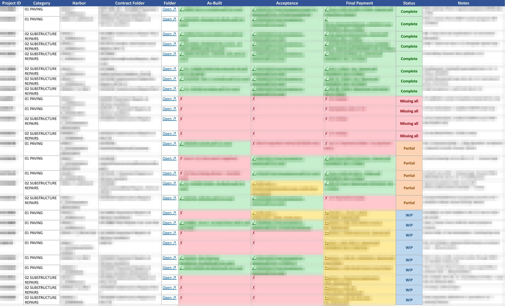

As an AI Process Automation intern at the Hawaii Department of Transportation Harbors Division, I was given a problem where auditing construction management contracts meant opening every file attached to every contract and copying the relevant fields into a tracker by hand. For their average engineer on-site, they would be handling 55 contracts which had roughly 3,000 files. If they were to review it all in one sitting, it would take them about 11 hours.

The tracker I proposed replaces that manual labor. It sifts through the contract folders on Google Drive, normalizes each file into text regardless of type, such as PDFs, scanned documents, spreadsheets, Word files, emails and hands the text to an LLM with a prompt tuned to pull out the fields auditors actually check. The extracted records are transferred to a single reformatted tracker the team can review. The same 55 contracts now take about 28 minutes since the LLM handles the sorting.

Getting the extraction right mattered less than making it checkable. Every record keeps a pointer back to its source file as a proof of existence, so their engineer can simply view the status of a project by color instead of reading contract documents hidden under 10+ parent folders.

Beyond the tracker, I own the AI tool integration and SharePoint data architecture for our four-person team, and also built the reusable prompt libraries the team draws from. I presented this work as the Harbors Division's featured student presenter at the HDOT Intern Recognition Summit, coordinating a seven-intern project on AI-assisted construction management.

Note: The contract data belong to the State of Hawaii, so I had redacted possibly sensitive information from the screenshot of my tracker.
