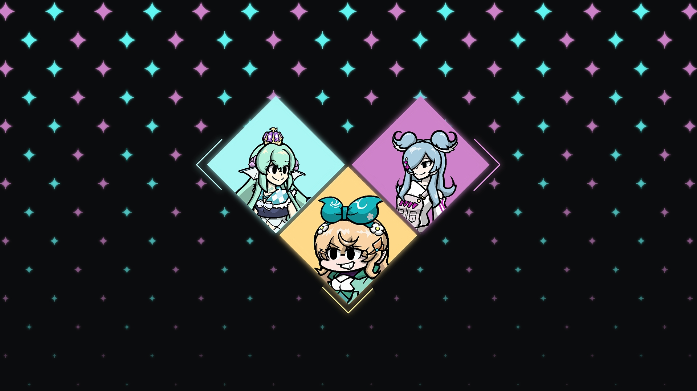

LazuNight Funkin' is a Friday Night Funkin' mod built on Psych Engine, made for LazuLight's first anniversary. It started as a three-person prototype and shipped six months later with twelve people on it: programmers, artists, and composers, all volunteering for this passion project. I directed and worked closely with each section.

The finished mod shipped four original tracks, two of them remixes of the talents' own songs, plus a two-phase playable character, custom noteskins and dialogue boxes that I designed, and original stage art and dialogue portraits. Small next to the big FNF mods, but each of those was something a specific person had to be assigned, scheduled, and provided a vision on.

The turning point was the prototype trailer. Where, after we launched it with our initial team of 3, the LazuLight Anniversary Web Development Team approached us and requested to showcase our project on their page. This turned into an official partnership and, with it, the credibility to reach a larger audience.

Running a volunteer project in High School taught me things a graded assignment can't. I picked up personal skills from the experienced programmers, design philosophies from the artists, and music theory from composers. Nobody was obligated to be there, so scope had to stay small enough that people saw their work reach players, and the schedule had to survive contributors disappearing for a week without warning. We shipped on the date we announced, which I'm still proud of.

At launch the game reached 26,000+ views, 2,200+ downloads, and 600+ likes across all platforms.

Play it here: <a href="https://gamebanana.com/mods/382213">LazuNight Funkin' on GameBanana</a>
