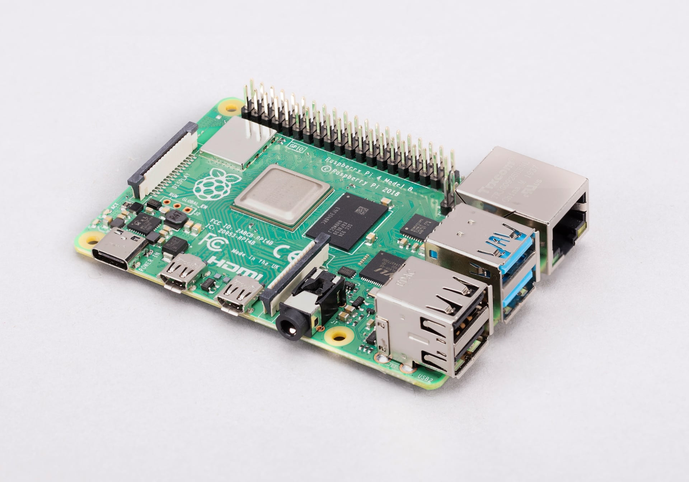

ResNet is the team that keeps wired and wireless internet service running in UH Mānoa's student housing. Requests come in through the Pilikia ticketing system, and as a Support Specialist my job was to go out and resolve them. In practice that meant a browser tab I refreshed between tasks, which is a poor way to catch a ticket when I am not at the desktop. Most of the job is spent away from it.

There was a small Christmas tree sitting on the desk. My supervisor told me it was meant to solve exactly that problem. A student worker had built it years earlier, it had been broken for a while, and according to him no student employee since then had gotten it working again. All I knew going in was that it involved a Raspberry Pi and our ticketing system. I had not used either one. I was also the only student worker in the office at the time, so this was something I wroked on between tickets rather than sat down with.

Most of the work was reading whatever documentation was left on our employee site and rebuilding it from scratch in Python.

What it does: on an interval it checks Pilikia for open requests, then checks the message logs to see whether anyone has responded to them yet. If a request is sitting there unanswered, the tree lights up. If a ticket had been replied to, it stays dark. The point is that I can tell the state of the queue from across AND outside the room instead of from the monitor in a small tab.

The tree plugs straight into a powered USB hub. The Pi turns it on and off with uhubctl, a tool that cuts power to individual USB ports from the command line. That was the part I was not sure would work, since it means controlling the tree by killing power to a USB port rather than wiring anything directly. It does mean you only get on and off with nothing in between, but there is nothing to solder and nothing to redo when the desk gets rearranged.

The tree lit up again for the first time in years after I pushed the code. That was the most satisfying part of the project, of course.

The code is stored locally at my old Office and on the ResNet servers rather than on GitHub, so there is no public repository for this one.

